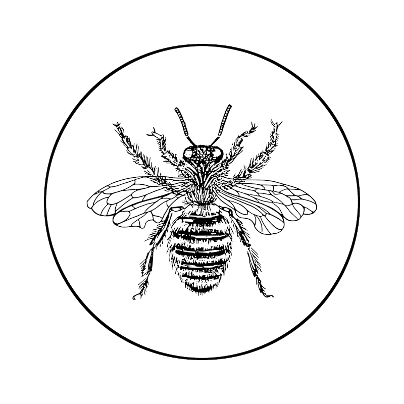

<p align="center">
  
</p>

# Intro

**Bee.js** is a helper tool for working with Web Workers. It uses an [Express](http://expressjs.com/)-like syntax.

# Installation

```bash
npm install --save @jrc03c/bee
```

# Usage

First, include the main bee.js script in your web page:

```html
<script src="path/to/dist/bee.js"></script>
```

Then create a "queen" bee, which will be used to send commands to the drone(s). Then add a drone using the path to the relevant Web Worker file.

```js
const queen = new Bee.Queen()
queen.addDrone("path/to/worker.js")
```

Then issue commands:

```js
queen.command("double", 32).then(result => {
  console.log("The result is:", result)
})
```

Of course, nothing will happen yet because we haven't actually defined what's in `worker.js`! So, let's do that now. In `worker.js`, do:

```js
importScripts("path/to/dist/bee.js")
const drone = new Bee.Drone()

drone.on("double", function (request, response) {
  let x = request.data
  return response.send(x * 2)
})
```

Now, everything should work!

We can also add multiple drones if we want to run many operations in "parallel." Of course, it's probably not really parallel. I don't know what's going on at a low level, but it's probably time-sliced or something to appear parallel. In any case, we can do:

```js
queen.addDrones("path/to/worker.js", 10)
```

Now the result of our commands will be an array of values rather than a single value (i.e., a single result from each drone).

To shut everything down, call:

```js
queen.destroy()
```

This terminates the queen and all workers such that none of them can be used again.

# API

## `Queen`

### Methods

#### `Queen(path=undefined, n=1)` (constructor)

Creates a new `Queen` instance. If a `path` to a web worker file is provided, then `n` drones will be created automatically using the `addDrone` method; otherwise, no drones will be created.

#### `queen.addDrone(path)`

Creates a new drone given a `path` to a web worker file and adds it to the `hive`.

#### `queen.addDrones(path, n)`

Creates `n` new drones given a `path` to a webworker file and adds them to the `hive`.

#### `queen.command(signal, payload)`

Same as `queen.emit(signal, payload)` but defined so that the queen metaphor can be carried a little further.

#### `queen.destroy()`

Destroys the queen and all drones in the hive. After this is called, the queen and drones will no longer be usable.

#### `queen.emit(signal, payload)`

Emits `signal` to the drone(s) and sends along the payload. Returns a `Promise` that resolves to the value(s) returned from the drone(s). If there's only one drone in the hive, then only a single value will be returned; but if there are multiple drones in the hive, then an array of results will be returned (i.e., one result per drone).

#### `queen.on(signal, callback)`

Causes the queen to listen for `signal` and invoke the `callback` function when she hears it. The function must accept `request` and `response` parameters and must call the `response.send` method when finished. The `on` method returns an unsubscribe function that removes the `callback` from the list of functions invoked by the queen when she hears `signal`. For example:

```js
const queen = new Bee.Queen("worker.js")

const unsub = queen.on("one-time-event", (request, response) => {
  unsub() // stop listening for "one-time-event"
  const result = someFunctionOf(request.data)
  return response.send(result)
})
```

### Properties

#### `queen.context`

Refers to `window`.

#### `queen.hasBeenDestroyed`

A boolean indicating whether or not the queen has been destroyed.

#### `queen.hive`

An array of `Drone` instances. These are called into action when the queen invokes her `emit` method.

#### `queen.isDead`

Same as `hasBeenDestroyed` but defined so that the queen metaphor can be carried a little further.

#### `queen.rejects`

An array of `reject` functions (i.e., those used in a `Promise`). Generally, you won't need to access these directly; in fact, it's probably a bad idea to do so. They're just kept around so that all `Promise`s can be resolved or rejected immediately and automatically when the queen is destroyed.

#### `queen.resolves`

An array of `resolve` functions (i.e., those used in a `Promise`). Generally, you won't need to access these directly; in fact, it's probably a bad idea to do so. They're just kept around so that all `Promise`s can be resolved or rejected immediately and automatically when the queen is destroyed.

#### `queen.unsubs`

An array of unsubscription functions (i.e., those returned from invoking the `queen.on` method). Generally, you won't need to access these directly; in fact, it's probably a bad idea to do so. They're just kept around so that all signal listeners can be turned off immediately and automatically when the queen is destroyed.

## `Drone`

### Methods

#### `Drone(path)` (constructor)

Creates a new `Drone` instance. If the drone is created in the window context, then the `path` to a web worker file _must_ be passed. Otherwise, if the drone is created in a web worker context, then a `path` _must not_ be passed.

#### `drone.destroy()`

Removes all signal listeners and (if the drone lives in the window context) destroys the corresponding web worker. Specifically, the corresponding worker's [`terminate`](https://developer.mozilla.org/en-US/docs/Web/API/Worker/terminate) method is invoked, which causes the worker to be terminated _immediately_ without any chance to finish whatever it might be working on.

#### `drone.emit(signal, payload)`

Emits `signal` to the corresponding worker and sends along the payload. Returns a `Promise` that resolves to the value returned from the worker.

#### `drone.on(signal, callback)`

Causes the drone to listen for `signal` and invoke the `callback` function when he hears it. The function must accept `request` and `response` parameters and must call the `response.send` method when finished. The `on` method returns an unsubscribe function that removes the `callback` from the list of functions invoked by the drone when he hears `signal`. For example:

```js
const drone = new Bee.Drone("worker.js")

const unsub = drone.on("one-time-event", (request, response) => {
  unsub() // stop listening for "one-time-event"
  const result = someFunctionOf(request.data)
  return response.send(result)
})
```

#### `drone.propose(signal, payload)`

Same as `drone.emit(signal, payload)`.

### Properties

#### `drone.context`

Refers to the corresponding web worker in the window context or `globalThis` in the worker context.

#### `drone.hasBeenDestroyed`

A read-only boolean indicating whether or not the drone has been destroyed.

#### `drone.isDead`

Same as `drone.hasBeenDestroyed` but defined so that the drone metaphor can be carried a little further.

#### `drone.rejects`

An array of `reject` functions (i.e., those used in a `Promise`). Generally, you won't need to access these directly; in fact, it's probably a bad idea to do so. They're just kept around so that all `Promise`s can be resolved or rejected immediately and automatically when the drone is destroyed.

#### `drone.resolves`

An array of `resolve` functions (i.e., those used in a `Promise`). Generally, you won't need to access these directly; in fact, it's probably a bad idea to do so. They're just kept around so that all `Promise`s can be resolved or rejected immediately and automatically when the drone is destroyed.

#### `drone.unsubs`

An array of unsubscription functions (i.e., those returned from invoking the `drone.on` method). Generally, you won't need to access these directly; in fact, it's probably a bad idea to do so. They're just kept around so that all signal listeners can be turned off immediately and automatically when the drone is destroyed.
